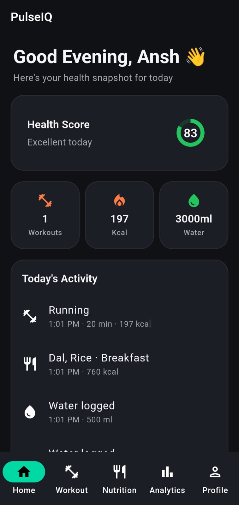
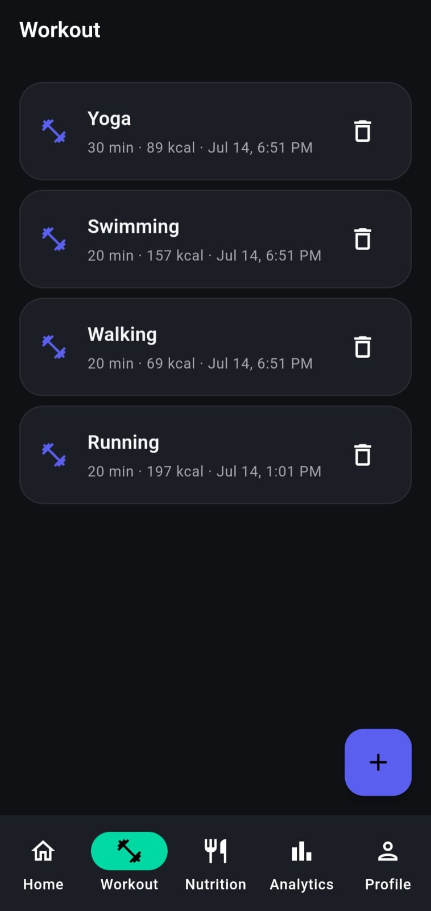
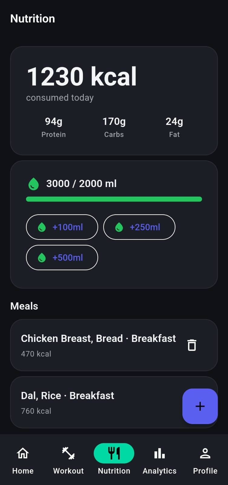
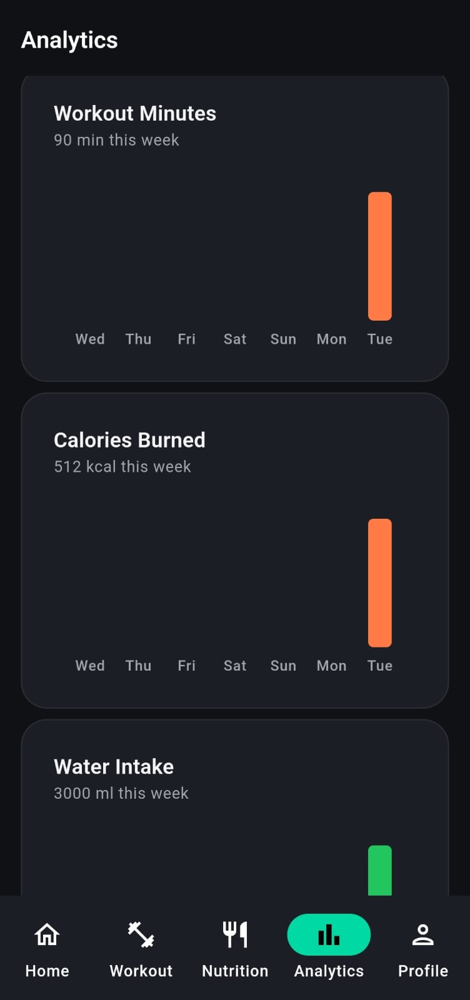
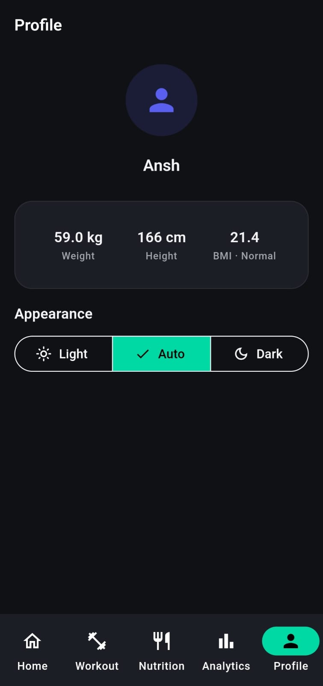
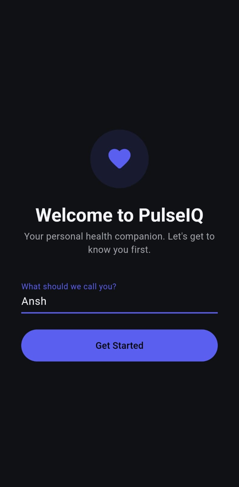

<div align="center">


# PulseIQ

### Your Personal Health Companion

**A Flutter fitness & nutrition tracker built for the CodeAlpha App Development Internship — Task 3**

<br/>


<br/>

[](https://github.com/AnshAI7/PulseIQ)
[](https://drive.google.com/file/d/15J0XzULFHmFv44edtpjrQkOTGCemNi9Y/view?usp=drive_link)
[](https://www.linkedin.com/in/anshmishra701)
[](https://github.com/AnshAI7)

</div>

---git remote set-url origin https://github.com/AnshAI7/PulseIQ.git
git push -u origin main

## 📥 Download

| Resource | Link |
|---|---|
| 📦 Source Code | [https://github.com/AnshAI7/PulseIQ](https://github.com/AnshAI7/PulseIQ) |
| 📱 APK (install directly on Android) | [Download APK](https://drive.google.com/file/d/15J0XzULFHmFv44edtpjrQkOTGCemNi9Y/view?usp=drive_link) |
| 🎥 Demo Video | [Watch Demo](https://drive.google.com/file/d/1Loqz9flEBQ5kRI1TPpq9jUCg6h27ctVI/view?usp=sharing) |

> The APK is distributed via Google Drive rather than committed directly to the repo — keeps the repository lightweight and avoids binary bloat in version control.

---

## 📋 Table of Contents

- [About](#-about)
- [Demo Video](#-demo-video)
- [Screenshots](#-screenshots)
- [Features](#-features)
- [Tech Stack](#️-tech-stack)
- [Architecture](#️-architecture)
- [Key Technical Decisions](#-key-technical-decisions)
- [Getting Started](#-getting-started)
- [Challenges Faced & How I Solved Them](#-challenges-faced--how-i-solved-them)
- [Roadmap — What's Next (v2)](#-roadmap--whats-next-v2)
- [Known Limitations](#️-known-limitations)
- [Developer](#-developer)
- [Connect With Me](#-connect-with-me)
- [License](#-license)
- [Credits](#-credits)

---

## 📱 About

**PulseIQ** is a health and fitness tracking app that goes beyond a basic logger — it estimates calories burned from your own body weight, merges everything you log into one real activity timeline, and turns weekly trends into actual charts instead of raw numbers.

It was built solo over a 7-day sprint as part of CodeAlpha's App Development internship (Task 3: Fitness Tracker App), and pushed further than the original brief — a full onboarding flow, multi-item meal logging with quantity scaling, MET-based calorie estimation, and a custom-designed adaptive app icon were all added beyond the base requirements.

---

## 🎥 Demo Video

<div align="center">

[](https://drive.google.com/file/d/1Loqz9flEBQ5kRI1TPpq9jUCg6h27ctVI/view?usp=sharing)

*A full walkthrough of the app — onboarding, dashboard, logging a workout, logging a meal, and analytics.*

</div>

---

## 📸 Screenshots

<div align="center">

<table>
  <tr>
    <td align="center"><b>Home</b></td>
    <td align="center"><b>Workout</b></td>
  </tr>
  <tr>
    <td></td>
    <td></td>
  </tr>
  <tr>
    <td align="center"><b>Nutrition</b></td>
    <td align="center"><b>Analytics</b></td>
  </tr>
  <tr>
    <td></td>
    <td></td>
  </tr>
  <tr>
    <td align="center"><b>Profile</b></td>
    <td align="center"><b>Onboarding</b></td>
  </tr>
  <tr>
    <td></td>
    <td></td>
  </tr>
</table>

</div>

---

## ✨ Features

### 🏠 Home Dashboard
- Time-aware, name-aware greeting ("Good Morning, Ansh 👋")
- A real **Health Score** — computed live from today's water intake and workout minutes against daily guidelines, not a hardcoded number
- Quick stats: workouts logged, calories burned, water intake today
- **Today's Activity** — a single merged timeline combining Workout, Meal, and Water logs, sorted by time

### 🏋️ Workout Tracking
- Log exercise type, duration, and calories burned
- **Automatic calorie estimation** using the MET (Metabolic Equivalent of Task) formula, based on your saved weight — auto-fills as you type, but never overwrites a value you've edited yourself
- Full history with delete support

### 🍽️ Nutrition & Water
- Log meals made of **multiple food items** in one entry (e.g. Dal + Rice + Chai as a single "Lunch")
- **Quantity scaling** per item — 2 eggs vs 5 eggs, 100ml vs 500ml milk, calculated automatically
- Autocomplete search over 20 common foods with pre-filled nutrition, or add anything custom
- One-tap water logging (+100ml / +250ml / +500ml)
- Daily calorie, protein, carb, and fat totals

### 📊 Analytics
- 7-day trend charts for Workout Minutes, Calories Burned, and Water Intake, built with `fl_chart`
- Only charts data the app actually tracks — no fake or empty graphs for untracked metrics

### 👤 Profile & Settings
- Name, weight, and height — with **live BMI calculation**
- Light / Dark / Auto theme toggle, applied instantly app-wide
- Custom adaptive app icon (gradient-based, designed to match the app's own color system)

### 👋 Onboarding
- First-launch name capture — no separate "first launch" flag, just checks if a name has been saved yet
- Feeds directly into the Home dashboard's personalized greeting

---

## 🛠️ Tech Stack

| Category | Choice | Why |
|---|---|---|
| Framework | Flutter (Dart) | Cross-platform from one codebase |
| State Management | Provider | Official, simple, sufficient for this app's scale |
| Local Database | Hive + Hive Generator | Fast, lightweight NoSQL, type-safe with codegen |
| Settings Storage | SharedPreferences | Single-record data (profile/settings), not a list — doesn't need a full database |
| Charts | fl_chart | Weekly trend visualizations |
| Typography | Google Fonts (Plus Jakarta Sans) | A deliberate, non-default look |
| Icons (launcher) | flutter_launcher_icons | Auto-generates all Android/iOS icon sizes from one source image |
| Date Formatting | intl | Human-readable timestamps |

---

## 🏗️ Architecture

Feature-first folder structure — each feature is self-contained with its own models, providers, screens, and widgets:

```
lib/
├── core/                  # App-wide, no business logic
│   ├── theme/              # AppColors, AppTextStyles, AppTheme
│   └── constants/          # AppSpacing
├── features/
│   ├── home/                # Dashboard
│   ├── workout/             # Model, Provider, Screens
│   ├── nutrition/           # 2 models (Meal, WaterEntry), 1 unified Provider
│   ├── analytics/           # Chart widgets, reads other features' providers
│   ├── profile/             # Settings, Onboarding
│   └── ai/                  # Reserved for v2 (AI Coach)
├── routes/                 # Named routes — pushed screens only
└── shared/                  # Cross-feature widgets (e.g. the bottom-nav shell)
```

**Navigation uses two different systems on purpose:**
- The 5 main tabs (Home / Workout / Nutrition / Analytics / Profile) use an `IndexedStack` inside a persistent bottom nav bar — switching tabs never rebuilds a screen or loses scroll position.
- One-off screens you navigate *into* (Log Workout, Log Meal) use standard named routes via `Navigator.push`, since those genuinely need push/pop history.

---

## 🎯 Key Technical Decisions

A few choices that were deliberate, not accidental:

- **Hive vs. SharedPreferences split** — Hive stores growing collections (Workout, Meal, WaterEntry entries); SharedPreferences stores the Profile, which is a single record, not a list. Using Hive for everything would've been overkill; using SharedPreferences for everything would've meant manually serializing lists.
- **MET-based calorie estimation** — `calories ≈ MET × weight(kg) × duration(hours)`, a real exercise-science formula, not a guess. Falls back gracefully to manual entry if no weight is set yet.
- **Water modeled as discrete timestamped entries**, not a single running counter — this is what lets "Water logged · 9:15 AM · 500ml" appear as a real event in Today's Activity, and lets a weekly water trend chart exist at all.
- **A common-foods list instead of a nutrition API** — avoids needing an API key (and the real security risk of an API key sitting inside a *public* GitHub repo), keeps the app fully offline, and keeps costs at zero.
- **Box renaming over data migration** (`mealBoxV2`) — when the Meal schema changed to support multiple food items per meal, old saved data no longer matched the new shape. Renaming the box was a simpler, safer fix than writing a migration for what was still test data.
- **Impeller disabled on Android** (`AndroidManifest.xml`) — Flutter's newer rendering engine has known blank-screen compatibility issues on certain Android GPUs/OEMs. Falling back to the older Skia renderer trades a bit of animation smoothness for far broader real-device compatibility.

---

## 🚀 Getting Started

### Prerequisites
- Flutter SDK (Dart ^3.12.2 or compatible)
- Android Studio (for the Android toolchain and emulator)

### Setup

```bash
git clone https://github.com/AnshAI7/PulseIQ
cd pulse_iq

# Install dependencies
flutter pub get

# Generate Hive type adapters (required — the app won't build without this)
dart run build_runner build --delete-conflicting-outputs

# Run
flutter run
```

### Running Tests

```bash
flutter test
```

---

## 🐛 Challenges Faced & How I Solved Them

Real problems hit during the build, not a polished-after-the-fact list:

- **A schema change broke old saved data.** When I redesigned meals to hold multiple food items instead of one, Hive couldn't read previously-saved meals in the new shape. Fix: renamed the storage box (`mealBox` → `mealBoxV2`) so old data is simply never reopened, instead of writing a migration for data that didn't need preserving yet.

- **A phantom duplicate folder.** At one point VS Code's file explorer created a second `features` folder at the project root instead of inside `lib/`, and four screen files silently landed in the wrong place. It took tracing `flutter analyze`'s error output line by line (and a `dir`/`tree` check) to find the mismatch and move the files back.

- **Gradle builds failing with a `JAVA_HOME` error — that pointed to a Java path I'd never set.** Turned out Flutter has its own internal `jdk-dir` config, separate from the OS environment variable, and it was pointing at a broken Android Studio-bundled JDK. Fixed with `flutter config --jdk-dir="<path-to-a-working-JDK>"`.

- **A stale-value bug in calorie auto-estimation.** Clearing the workout duration field back to 0 left the *previous* calorie estimate sitting there instead of resetting — caught during manual testing, fixed by explicitly writing `'0'` in that edge case instead of silently doing nothing.

- **Real-device rendering risk, learned from a previous project.** A prior app (QuoteSpark) showed blank screens on some real phones despite working fine on emulator — traced to Flutter's Impeller renderer having known compatibility issues on certain Android GPUs. Disabled it proactively here via `AndroidManifest.xml` before it could cause the same issue.

---

## 🔮 Roadmap — What's Next (v2)

Deliberately scoped out of this submission — not forgotten, timed-out:

- **AI Coach** — a chat-style interface for questions like *"What should I eat today?"* or *"Suggest a home workout."* Planned from the start as Version 2 scope; a genuinely separate scale of feature (LLM integration, conversation UI) from the rest of the app.
- **Push notifications** — meal/water/workout reminders. Needs `flutter_local_notifications`, runtime permission handling (Android 13+), and testing around aggressive battery-optimization on certain Android OEMs that can silently kill scheduled reminders.
- **Weight & sleep progress tracking** — would need new Hive models and their own charts. Sleep specifically has no automatic data source without a wearable, so it'd be manual-entry only, which changes how useful/realistic the feature really is.
- **Step counter** — feasible using the device's built-in pedometer sensor (no wearable needed for most phones from ~2014+), but the sensor reports a cumulative since-reboot count, not "today's steps" — needs daily-reset logic and an `ACTIVITY_RECOGNITION` permission flow.
- **Photo-based meal logging with AI nutrition detection** — genuinely appealing, but requires a cloud AI vision API, meaning an API key, a per-request cost, and — since this repo is public — a real security risk if that key were ever committed. Scoped out until it can be handled properly (e.g. via a backend proxy).
- **Profile photo upload.**

---

## ⚠️ Known Limitations

- Health Score and water/workout goals use general guidelines (2000ml water, 30 active minutes), not personalized targets — real user-set goals are a natural v2 addition once there's a reason to store them.
- The common-foods list is a small curated set (~20 items), not a full nutrition database — anything else falls back to manual entry.
- Tested on Chrome (web) and Android emulator; not yet tested across multiple real Android device brands.

---

## 👨‍💻 Developer

<div align="center">

**Built solo, end to end** — product thinking, UI/UX, architecture, and implementation — by **Ansh**, as part of the [CodeAlpha](https://www.codealpha.tech) App Development Internship (Task 3: Fitness Tracker App).

</div>

---

## 🤝 Connect With Me

<div align="center">

[](https://www.linkedin.com/in/anshmishra701)
[](https://github.com/AnshAI7)
[](mailto:ansh87374@gmail.com)

</div>

---

## 📄 License

This project is licensed under the **MIT License** — see the [LICENSE](LICENSE) file for details.

```
MIT License

Copyright (c) 2026 Ansh

Permission is hereby granted, free of charge, to any person obtaining a copy
of this software and associated documentation files (the "Software"), to deal
in the Software without restriction, including without limitation the rights
to use, copy, modify, merge, publish, distribute, sublicense, and/or sell
copies of the Software, and to permit persons to whom the Software is
furnished to do so, subject to the following conditions:

The above copyright notice and this permission notice shall be included in
all copies or substantial portions of the Software.

THE SOFTWARE IS PROVIDED "AS IS", WITHOUT WARRANTY OF ANY KIND, EXPRESS OR
IMPLIED, INCLUDING BUT NOT LIMITED TO THE WARRANTIES OF MERCHANTABILITY,
FITNESS FOR A PARTICULAR PURPOSE AND NONINFRINGEMENT.
```

---

## 🙏 Credits

Built by **Ansh** as part of the [CodeAlpha](https://www.codealpha.tech) App Development Internship — Task 3: Fitness Tracker App.

- 📧 Email: [ansh87374@gmail.com](mailto:ansh87374@gmail.com)
- 💼 LinkedIn: [linkedin.com/in/anshmishra701](https://www.linkedin.com/in/anshmishra701)
- 🐙 GitHub: [github.com/AnshAI7](https://github.com/AnshAI7)

---

<div align="center">

### ⭐ If you found this project interesting, consider giving it a star!

<sub>Built with 💙 and Flutter, one feature at a time.</sub>

</div>